# Super Mario Kart — Deep Reinforcement Learning Agent

## What it Does
We trained autonomous agents to play Super Mario Kart on the SNES
using deep reinforcement learning, learning entirely from raw pixel
observations with no hand-crafted features. We implemented two agents
from scratch — Deep Q-Network (DQN) and Proximal Policy Optimization
(PPO) — and compared their performance across two tracks: MarioCircuit_M
and MarioCircuit4_M. Both agents use a custom CNN architecture to process
stacked grayscale frames and output discrete driving actions, trained with
custom reward shaping that incentivizes track progress and lap completion.
Our central research question: **can deep RL agents learn to drive from
raw pixels alone, and how do DQN and PPO compare on this task?**

## Quick Start
See [SETUP.md](SETUP.md) for installation. Once set up:
```bash
# Train the PPO agent
python train.py

# Evaluate all checkpoints + generate all plots and error analysis
python test.py
```

## Video Links
- 🎮 [Demo Video](https://drive.google.com/file/d/1NOCF5jBTGUE8oJ1EbTIFE4wct0Q7VcU1/view?usp=sharing)
- 🔧 [Technical Walkthrough](YOUR_LINK_HERE)

## Evaluation

### Model Comparison
All agents evaluated over 50 episodes per checkpoint on their
respective tracks. Full raw data in `eval_results/eval_log.csv`.

#### Best Checkpoint Per Agent
| Agent | Avg Return | Std Dev | Avg Checkpoint | Avg Ep Length |
|---|---|---|---|---|
| Random Baseline | -133.6 | 74.5 | 3.7 | 1000.4 |
| DQN Circuit_M best (ep 2750) | 6632.4 | 1647.4 | 142.1 | 1270.5 |
| DQN Circuit4_M best (ep 2750) | 7789.3 | 1082.1 | 199.3 | 2410.1 |
| PPO Circuit_M best (ep 500) | 338.3 | 171.6 | 4.2 | 1320.4 |
| PPO Circuit4_M best (ep 2000) | 236.5 | 138.0 | 2.4 | 1103.4 |

#### DQN MarioCircuit_M — Full Progression
| Checkpoint | Avg Return | Std Dev | Avg Checkpoint | Avg Ep Length |
|---|---|---|---|---|
| ep 250 | -97.2 | 6.6 | 0.1 | 311.2 |
| ep 500 | 118.1 | 353.6 | 10.7 | 744.4 |
| ep 750 | -138.6 | 66.0 | -9.7 | 336.8 |
| ep 1000 | 245.3 | 672.7 | 9.0 | 562.3 |
| ep 1250 | 70.4 | 288.7 | 3.7 | 525.5 |
| ep 1500 | 5552.8 | 2399.9 | 121.0 | 1559.7 |
| ep 1750 | 5861.4 | 2397.8 | 125.6 | 1427.6 |
| ep 2000 | 6538.2 | 1633.1 | 139.1 | 1442.0 |
| ep 2250 | 6516.0 | 1765.6 | 138.6 | 1280.5 |
| ep 2500 | 5435.1 | 2556.7 | 118.5 | 1155.6 |
| ep 2750 | 6632.4 | 1647.4 | 142.1 | 1270.5 |
| ep 3000 | 6255.6 | 1987.2 | 136.0 | 1267.0 |

#### DQN MarioCircuit4_M — Full Progression
| Checkpoint | Avg Return | Std Dev | Avg Checkpoint | Avg Ep Length |
|---|---|---|---|---|
| ep 500 | -109.4 | 2.4 | -0.9 | 300.0 |
| ep 1500 | 187.6 | 89.4 | 11.5 | 825.9 |
| ep 2000 | 5104.0 | 3012.9 | 134.6 | 2126.3 |
| ep 2250 | 5254.9 | 3095.1 | 139.2 | 2144.8 |
| ep 2500 | 6143.8 | 2444.3 | 161.9 | 2204.2 |
| ep 2750 | 7789.3 | 1082.1 | 199.3 | 2410.1 |
| ep 3000 | 1862.7 | 1898.8 | 59.8 | 1110.0 |

#### PPO MarioCircuit_M — Full Progression
| Checkpoint | Avg Return | Std Dev | Avg Checkpoint | Avg Ep Length |
|---|---|---|---|---|
| ep 500 | 338.3 | 171.6 | 4.2 | 1320.4 |
| ep 1000 | 335.7 | 122.2 | 4.4 | 1334.4 |
| ep 1500/early | -116.1 | 30.6 | 0.4 | 734.8 |

#### PPO MarioCircuit4_M — Full Progression
| Checkpoint | Avg Return | Std Dev | Avg Checkpoint | Avg Ep Length |
|---|---|---|---|---|
| ep 500 | 179.0 | 116.2 | 1.4 | 799.7 |
| ep 1000 | 183.6 | 129.0 | 2.2 | 803.2 |
| ep 1500 | 152.8 | 86.4 | -0.3 | 803.3 |
| ep 2000 | 236.5 | 138.0 | 2.4 | 1103.4 |
| ep 2500 | 105.8 | 118.3 | -2.7 | 828.0 |
| final | 96.9 | 184.9 | -7.1 | 824.9 |

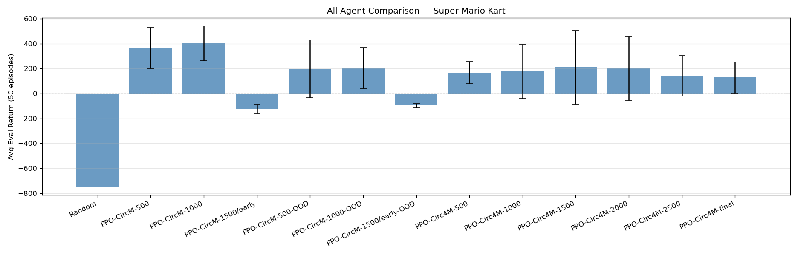
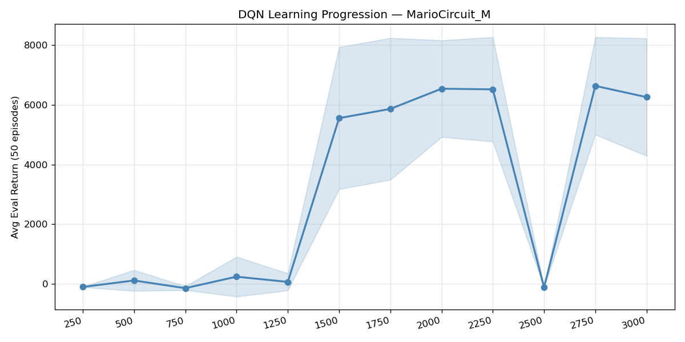
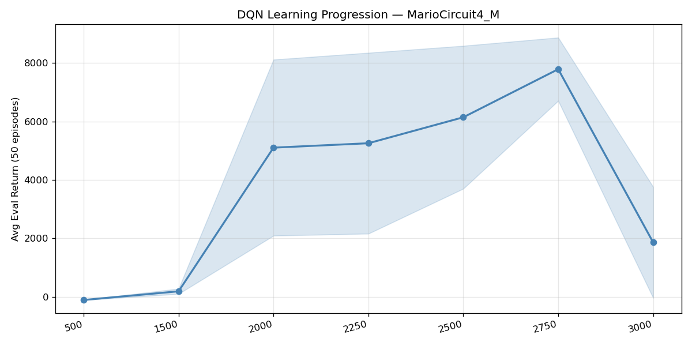
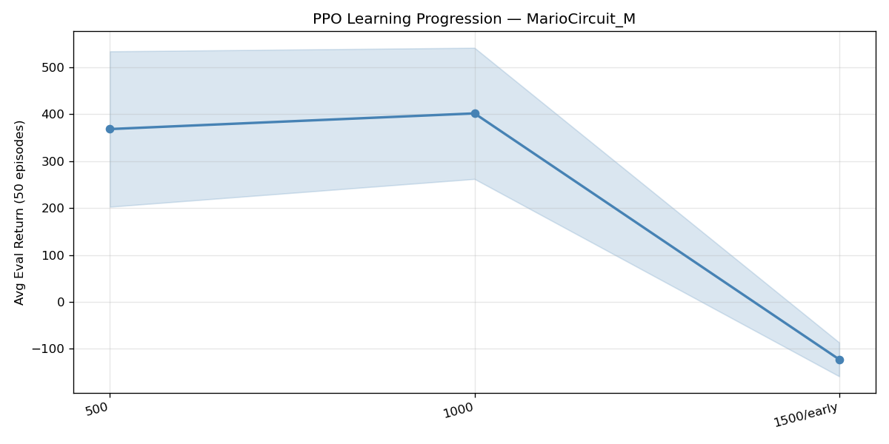
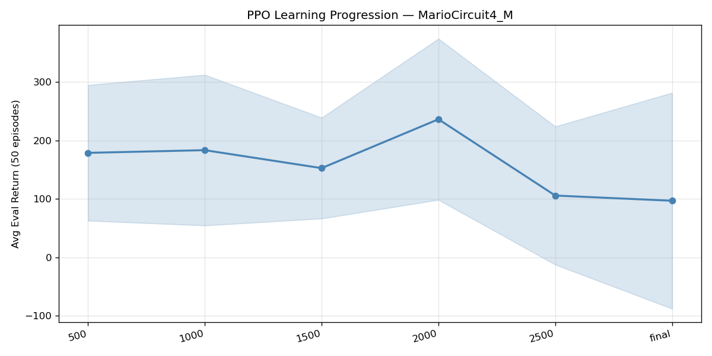
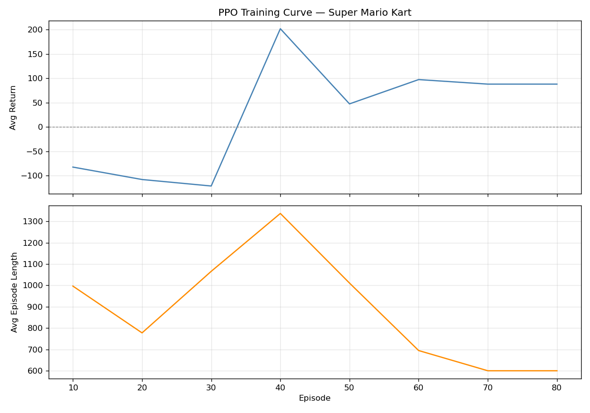

### Key Findings
- **DQN significantly outperformed PPO** on both tracks, achieving a
  best avg return of 6632 (Circuit_M) and 7789 (Circuit4_M) vs PPO's
  best of 338 (Circuit_M) and 236 (Circuit4_M). We believe this might be due in large part to us tailoring our reward function specifically to developing the DQN agent, like the high-reward for lap completion that works well for DQN but seemingly not for PPO. In order to keep our agents comparable we didn't modify it at all for the PPO. DQN's off-policy
  experience replay allowed it to learn from rare high-reward lap
  completion events more efficiently than PPO's on-policy rollouts.
- **Both agents vastly outperformed the random baseline** (-133.6 avg
  return) once training matured past episode 1500 for DQN and episode
  500 for PPO. So despite difficulties with the PPO agent, both architectures were demonstrably able to learn beyond simply random input.
- **DQN showed a sharp performance jump at episode 1500** on
  Circuit_M, going from near-zero returns to 5552 avg return — the
  point at which the agent learned to complete full laps consistently
  (avg checkpoint reached 121 vs 3.7 prior).
- **PPO was more stable but plateaued earlier** — returns stayed in
  the 150–340 range throughout training on both tracks with no
  breakthrough to high-return lap-completion behavior.
- **PPO early-stopped at episode 1500 on Circuit_M** with degraded
  performance (-116 avg return), indicating the policy collapsed
  rather than converged — consistent with the catastrophic forgetting
  pattern we documented in the Model Development section.

### Error Analysis
We categorised evaluation episodes into four failure types:

| Failure Type | Definition |
|---|---|
| `never_moved` | Final checkpoint = 0, did not time out | Agent not yet learned gas action produces reward; concentrated in DQN ep 250 (44/50 episodes) and early PPO Circuit4M checkpoints |
| `stuck_early` | Stuck termination fired, checkpoint < 5 | Discrete action space (5 actions) lacks fine-grained steering; agent trapped on tight corners. Dominant failure for PPO (43/50 at early-stop checkpoint) and early DQN |
| `timeout` | Hit `max_timesteps` without terminating | Agent drives forward but corners inefficiently — absent in most trained agents, replaced by success |
| `success` | Meaningful checkpoint progress made | N/A — DQN-Circ1 at ep 1500+ achieves 50/50 success consistently |

#### **Key Case Studies: Failure Mode Analysis**

Below is a breakdown of the primary failure cases identified during the training and evaluation phases of our DQN agent.

---

**1. The "Under-Trained" Policy (Early Stagnation)**
* **Description:** This is the most trivial failure state, occurring during the initial epsilon-heavy exploration phase. 
* **Analysis:** At this stage, the agent has not yet correlated the "Gas" button with positive reward returns or progress through the state space. It often remains at the starting line or performs erratic, non-directional movements. This serves as our baseline for "zero-knowledge" behavior.

**2. The "Frozen" Agent (Negative Reward Avoidance)**
* **Description:** Despite reaching late-stage training, some agents would abruptly cease all movement. 
* **Analysis:** This phenomenon usually followed a sharp decline in mean rewards. It is a classic example of a **local optimum** caused by our penalty structure. Because wall collisions carried a heavy negative weight, the agent mathematically determined that the "safest" way to minimize loss, if it could not guarantee a clean line through a turn, was to remain perfectly stationary. In its "view," zero reward was preferable to the guaranteed negative reward of a collision.
*insert picture*

**3. Recovery Deadlocks (Action Space Constraints)**
* **Description:** Even high-performing agents occasionally became permanently lodged behind environmental obstacles, such as pipes or corners.
* **Analysis:** This failure is not a failure of the model’s "intelligence," but rather a **State-Action Bottleneck**. We observed agents stuck behind pipes where the only solution was to reverse. However, to keep the model's complexity manageable, we did not include a "Reverse" action in the discrete action space. The agent was effectively trapped in a **dead-end state**: driving forward caused a penalty, and staying still yielded zero progress. Without a "Back Up" option, the agent had no valid trajectory to escape.
*insert picture*

**4. The Performance "Ceiling" (Mechanical Bottlenecks)**
* **Description:** We observed a hard cap on lap times; regardless of extended training duration or hyperparameter tuning, the agent could not break certain time barriers.
* **Analysis:** When comparing our agent to state-of-the-art models online, we realized we had reached an **Action Space Ceiling**. To simplify the learning process, we excluded advanced mechanics like **drifting (power-sliding)** and **brake-turning**. While this made the initial policy easier to learn, it removed the agent's ability to maintain high velocity through tight corners. Our model learned the "perfect" line for its limited toolkit, but it was mechanically incapable of matching the speeds achievable through the game's more complex physics.


#### **Model Evaluation and Comparative Analysis**

Below is a detailed analysis of our experimental results across different architectures and circuits, highlighting the specific challenges of policy stability, sample diversity, and reward sensitivity.

---

#### **1. DQN Performance: Circuit M**
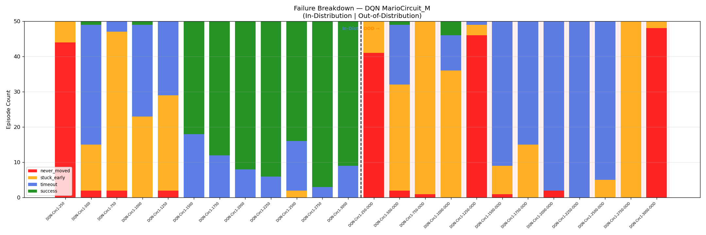

**Observations:**
The DQN agent on Circuit M demonstrated strong convergence during the mid-to-late stages of training, achieving a **~100% success rate** by Episode 2750. However, as training continued beyond this peak, we observed a slight regression in reliability.

**Analysis — Late-Stage Policy Degradation:**
In the "Out of Distribution" phase, the model transitioned into **Case 2: The Frozen Agent**. As the agent’s policy became more deterministic, it developed an extreme form of risk aversion. We found that the model eventually determined the optimal mathematical strategy was to cease all throttle input rather than risk the heavy negative penalties associated with wall collisions. This represents a failure in the balance of our reward shaping, where the penalty for "failure" (crashing) eventually outweighed the incentive for "success" (completing the lap).

---

#### **2. DQN Performance: Circuit 4M (Replay Buffer Collapse)**
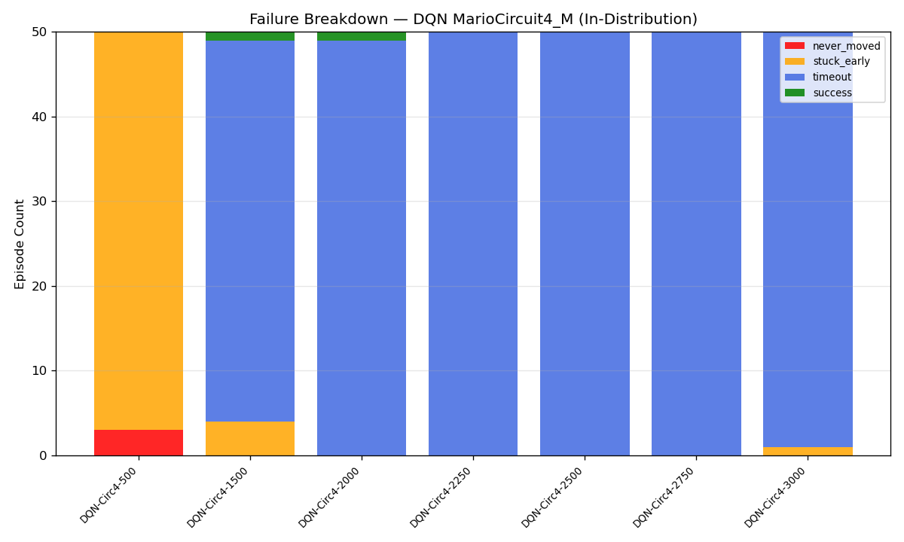

**Observations:**
The Circuit 4M model was **extremely performant** at Episode 2750, executing near-flawless laps. However, this was followed by a precipitous drop in performance that did not align with the typical "frozen agent" behavior.

**Analysis — Replay Buffer Collapse & Recovery Failure:**
We identified this phenomenon as **Replay Buffer Collapse**. As the agent became highly proficient, the Replay Buffer was systematically filled with "perfect" state-action pairs. Consequently, the agent stopped learning from "bad" data. 

By Episode 3000, the agent had effectively **"forgotten" how to recover from errors**. While it could drive a perfect line, the slightest stochastic deviation or environmental bump forced the agent into an unfamiliar state. Because the buffer no longer contained transitions for "recovering from a slide" or "re-centering after a collision," the model suffered from **Catastrophic Forgetting**, leading to total policy breakdown upon the first minor mistake.

---

#### **3. PPO Performance: Circuits M & 4M**
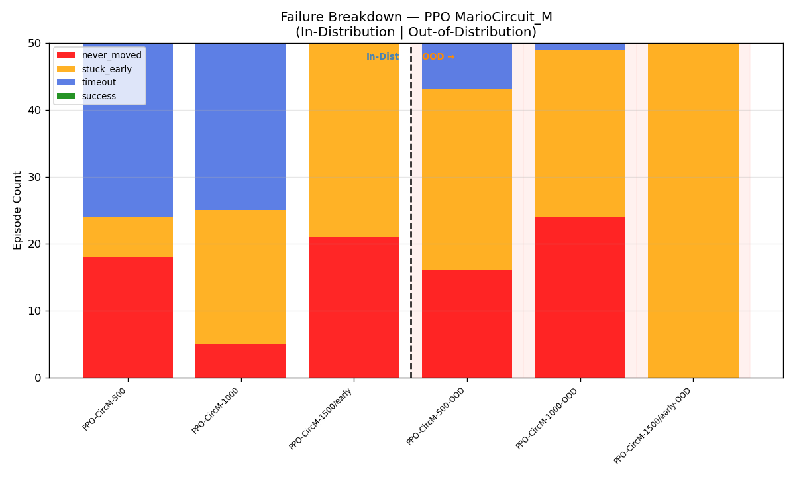
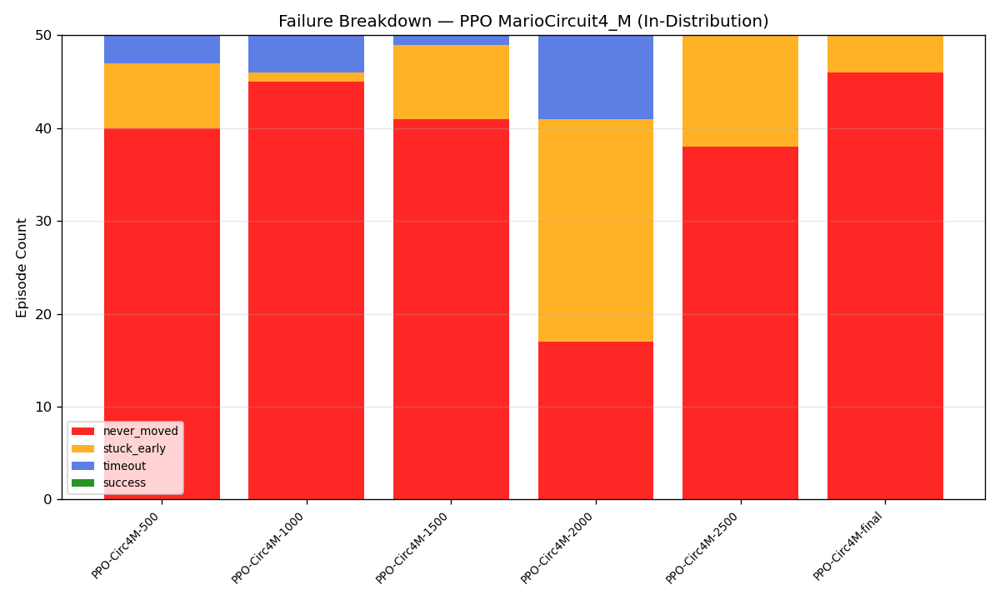

**Observations:**
In contrast to the DQN, our PPO (Proximal Policy Optimization) agents struggled to develop a viable racing policy on either circuit. While they consistently outperformed a random-action baseline, they never completed a full lap.

**Analysis — On-Policy Local Minima:**
The PPO agents fell victim to the **"Frozen Agent"** syndrome significantly earlier than the DQN models. We attribute this to PPO's **on-policy** nature. Because PPO learns only from the data

### Out-of-Distribution Generalisation
We evaluated Circuit_M-trained models on Circuit4_M (a track neither
agent trained on) to test transfer of learned driving skills.

<p style="text-align: center;">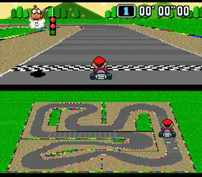</p>

**DQN generalisation:** 
Strong in-distribution performance (6632 avg
return at ep 2750) collapsed almost completely on Circuit4_M (-110 avg
return at ep 2750, 50/50 stuck_early). The exception was ep 2500 which
achieved 223.9 OOD avg return despite 0.0 in-distribution return —
an anomalous checkpoint where the policy happened to generalise better.
This indicates DQN learned track-specific Q-values rather than
transferable driving behavior.
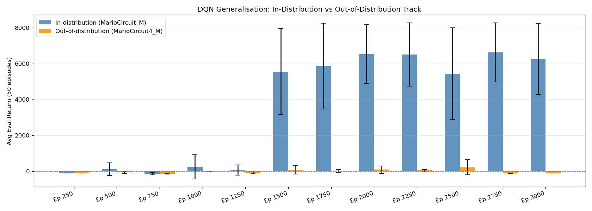

One particularly interesting point is how it still tries to drive circuit 4 the same way it drives circuit 1, by turning left on turn 1 and then trying to drive it like a straight away instead of a u-turn.

**PPO generalisation:** More consistent but weaker. PPO Circuit_M at
ep 500 retained 55% of its in-distribution return on Circuit4_M
(187.7 OOD vs 338.3 in-distribution), suggesting the CNN learned some
generalizable low-level features (edge detection, forward motion) but
not track-agnostic navigation.

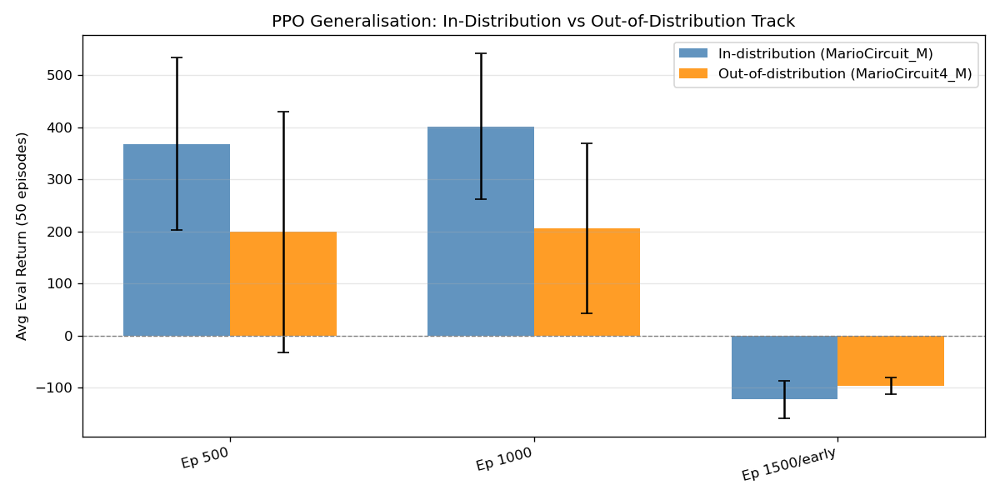

### Model Development Iterations

Our final PPO agent was the result of two improvement cycles, each
driven by training curve analysis and failure diagnosis.


### **Iteration 1: Transitioning from Collision-Based to Progress-Based Termination**

**The Problem: Training Stagnation & "The Lazy Agent"**
During initial training, we observed a massive spike in episode lengths (averaging 5,000+ frames) that severely throttled training throughput. Upon investigation, we discovered our early stopping mechanism, which terminated the episode after 3 wall collisions, was being exploited. The agent discovered a **local optimum**: by remaining stationary or "coasting" in front of a wall, it could avoid collisions and indefinitely delay the end of an episode. This resulted in a Replay Buffer flooded with thousands of identical, low-value frames of the agent staring at a wall, providing zero informational gain for the model.

**Changes Implemented:**
We shifted from collision-based termination to a **Progress-Based Timeout**. We implemented a "frames-without-progress" counter that resets only when the agent triggers a new track checkpoint (retrieved via RAM). If the agent fails to reach a new checkpoint within a specific window, the episode is terminated with a "stuck penalty."

```python
# Progress-based termination logic in wrapper.py
if checkpoint <= self.max_checkpoint:
    self.frames_without_progress += 1
else:
    self.max_checkpoint = checkpoint
    self.frames_without_progress = 0

# Trigger termination if progress stagnates
if self.frames_without_progress >= self.max_frames_without_progress:
    terminated = True
    reward += self.stuck_penalty
```

**The Result**: 10x Training Throughput
The impact was immediate. Average episode lengths during the early training phase (Episodes 0–1,500) plummeted from over 5,000 frames to approximately 500 frames.

- **Training Speed**: We achieved a 10x increase in iteration speed, allowing us to run more experiments per hour.
- **Sample Efficiency**: By clearing out the "static" data, the Replay Buffer was filled with diverse, high-quality transitions involving actual movement and track navigation.
- **Behavioral Shift**: The agent was forced to "explore or die," leading to much faster convergence on the basic driving policy.

**Iteration 2 — Stabilizing Reward Scale (MarioCircuit_M, Episodes 0–1500)**

During initial training we observed severe sawtooth oscillations —
the agent would occasionally reach returns above 500 on lap completion,
then immediately crash back to negative returns. We diagnosed this as
catastrophic forgetting caused by the raw +1000 lap reward. A single
successful lap produced a gradient shock large enough to overwrite the
policy's basic driving behavior in the next PPO update.

*What we measured:* high variance in avg return, erratic episode length
spikes, no stable performance floor.

*Change implemented:* replaced raw rewards with a symmetric log-transform
applied inside the PPO update:

```python
processed_reward = 5.0 * np.sign(reward) * np.log1p(np.abs(reward))
```

*Result:* the performance floor rose from -100 to a consistent +150.
The agent retained driving knowledge across updates rather than resetting
after each large reward event.

---

### Design Decision: DQN vs PPO
We developed both DQN and PPO to directly compare off-policy vs
on-policy learning on the same task. Contrary to our initial hypothesis
that PPO's stable on-policy updates would handle sparse rewards better,
DQN significantly outperformed PPO — achieving 6632 vs 338 avg return
at best checkpoints on Circuit_M. We attribute this to DQN's experience
replay allowing it to repeatedly train on the rare high-reward lap
completion events, while PPO's on-policy rollouts discarded this
experience after each update. This finding highlights a key tradeoff:
PPO offers training stability and smoother convergence, but DQN's
sample reuse is a decisive advantage when high-value transitions are
rare.

## Individual Contributions
- **Avi Wagner:** Implemented the PPO agent from scratch, including the
  Actor-Critic architecture, GAE advantage estimation, clipped surrogate
  objective, entropy scheduling, and rollout buffer management
  (`agents/ppo_agent.py`). Designed and ran all PPO training runs across
  both MarioCircuit_M and MarioCircuit4_M, including the two
  hyperparameter tuning iterations documented above. Built the full
  evaluation pipeline (`test.py`) including multi-checkpoint evaluation,
  cross-track OOD testing, error analysis categorisation, and all plot
  generation.

- **Tanner McLeod:** Implemented the DQN agent from scratch, including
  experience replay buffer, target network architecture, and
  epsilon-greedy exploration (`agents/deep_rl_agent.py`). Built the
  core project infrastructure, including the custom Gymnasium wrappers
  (`wrapper.py`), The LUA-based reward function integration
  (`custom_integrations/`), the training loop (`train.py`), the
  environment configuration system (`config.py`), and the Dockerfile.
  Designed the reward shaping philosophy — incentivizing speed and
  checkpoint progress without harshly penalizing wall contact or
  off-road driving.

## Project Structure
```
MarioKart/
├── custom_integrations/
│   └── SuperMarioKart-Snes/         # Custom Stable Retro game integration files
├── eval_results/                    # Generated evaluation plots and metrics
│   ├── agent_comparison.png         # Best-agent comparison bar chart
│   ├── dqn_circuit1_progression.png # DQN learning progression on MarioCircuit_M
│   ├── dqn_circuit4_progression.png # DQN learning progression on MarioCircuit4_M
│   ├── dqn_ood_generalisation.png   # DQN in-distribution vs OOD comparison
│   ├── error_analysis_combined.png  # Combined error analysis summary
│   ├── error_analysis_dqn.png       # DQN-focused error analysis summary
│   ├── error_analysis_ppo.png       # PPO-focused error analysis summary
│   ├── error_dqn_circuit4M.png      # DQN failure breakdown on MarioCircuit4_M
│   ├── error_dqn_circuitM.png       # DQN failure breakdown on MarioCircuit_M
│   ├── error_ppo_circuit4M.png      # PPO failure breakdown on MarioCircuit4_M
│   ├── error_ppo_circuitM.png       # PPO failure breakdown on MarioCircuit_M
│   ├── error_random.png             # Random baseline failure breakdown
│   ├── error_scatter.png            # Scatter plot of episode returns by failure type
│   ├── eval_log.csv                 # Full episode-by-episode evaluation log
│   ├── ood_generalisation.png       # PPO in-distribution vs OOD comparison
│   ├── ppo_circuit4M_progression.png# PPO learning progression on MarioCircuit4_M
│   └── ppo_circuitM_progression.png # PPO learning progression on MarioCircuit_M
├── plots/
│   └── training_curve.png           # Training reward / episode length curve
├── src/
│   ├── agents/
│   │   ├── __init__.py              # Agents package marker
│   │   ├── deep_rl_agent.py         # Custom DQN agent with replay + target network
│   │   ├── ppo_agent.py             # Custom PPO / actor-critic implementation
│   │   └── random_agent.py          # Random-action baseline agent
│   ├── __init__.py                  # Source package marker
│   ├── config.py                    # Shared config / hyperparameters / runtime settings
│   ├── test.py                      # Single-run / checkpoint testing utilities
│   ├── total_test.py                # Full evaluation pipeline and plot generation
│   ├── train.py                     # Main training entry point
│   └── wrapper.py                   # Mario Kart wrappers: resize, frame-stack, action map, rewards
├── .gitignore                       # Git ignore rules
├── ATTRIBUTIONS.md                  # External sources, AI usage, and reference attributions
├── Dockerfile                       # Reproducible environment / container setup
├── README.md                        # Project overview, setup, results, and rubric evidence
└── requirements.txt                 # Python dependencies
```
